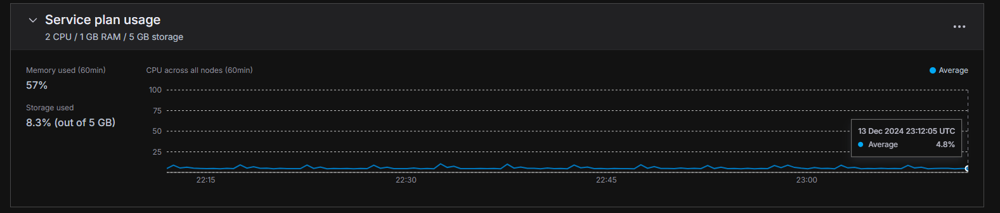

  

# 📚 책사랑 공간 | (Book Lover's Haven)

## Project Description

Greetings fellow author or reader! You've arrived to Book Lover's Haven or in korean (Chaeksarang Gonggan)
 
 
 

## ♦ Table of Contents

- **_[Project Planning Section](#project-planning-section)_**

### [♦](#table-of-contents) ⬅ The books is a clickable emoji, so you can redirect back to this list!

## Project Planning Section

#### [♦](#table-of-contents)

| **_Site Name_** | **_Description_**                                                                 | **_Link_**                                                                    | **_Image_**                                           |
| --------------- | --------------------------------------------------------------------------------- | ----------------------------------------------------------------------------- | ----------------------------------------------------- | ---------------------- |
| Trello Board    | I used this site for planning on the layout of how I'll be tackling this project. | [Trello Board](https://trello.com/b/4ukfgDIv/책사랑-공간-chaeksarang-gonggan) | [📁](./main_app/static/images/screenshots/trello.png) |  |
| Milanote        |                                                                                   |                                                                               |
| Figma           |                                                                                   |                                                                               |

### Trello Board

#### [📃](https://trello.com/b/4ukfgDIv/책사랑-공간-chaeksarang-gonggan) ⬅ Feel free to check out the board in how I plan this project!

###
